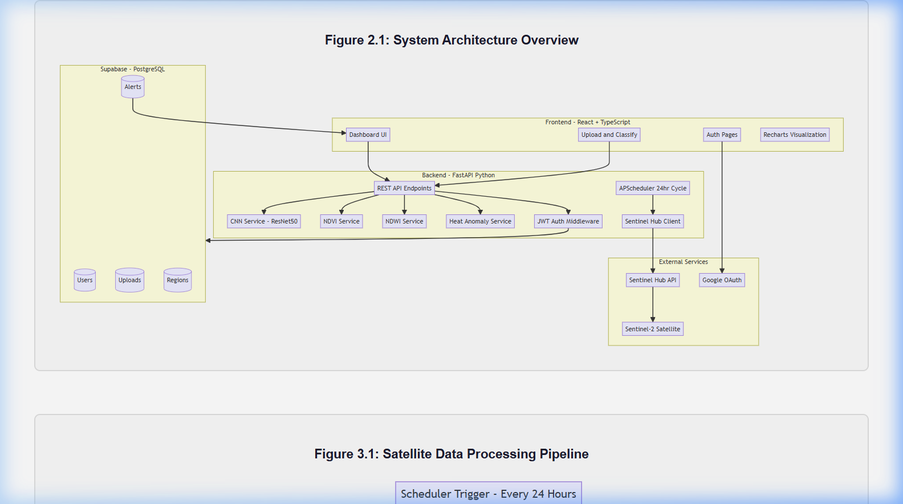
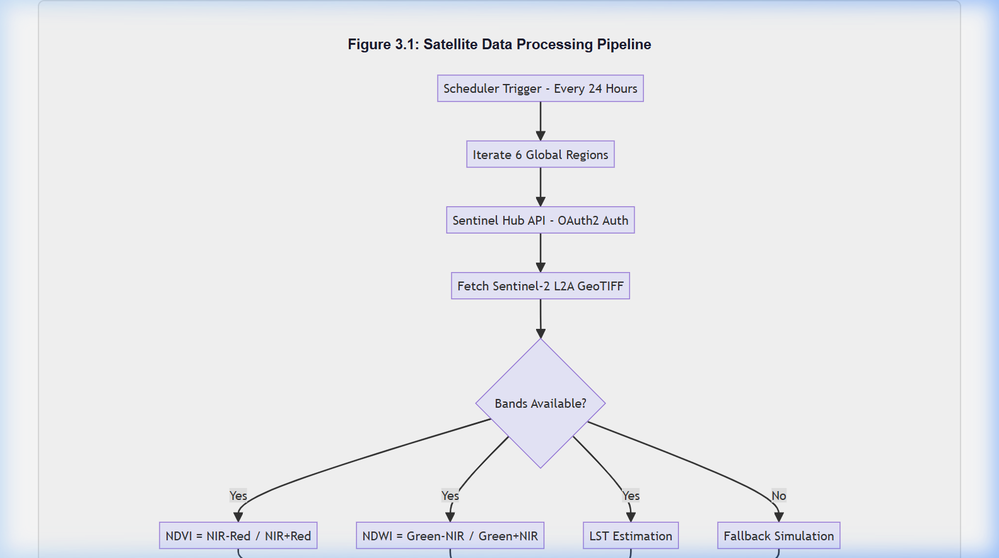
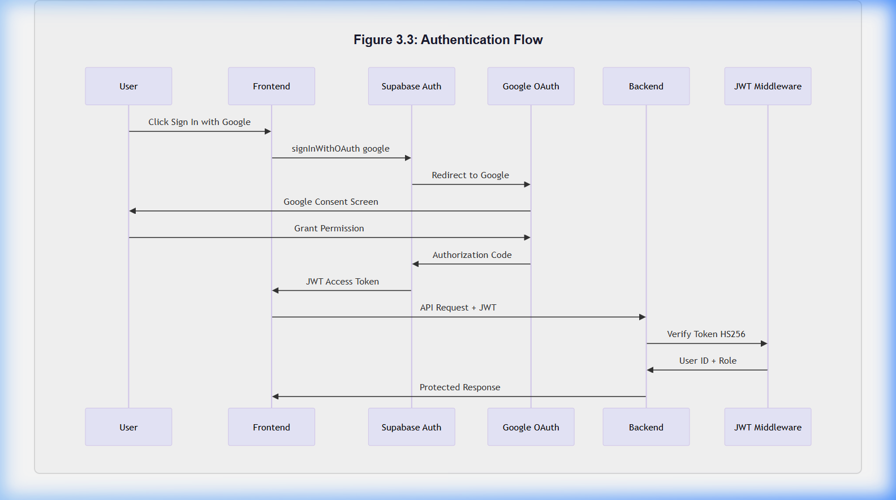
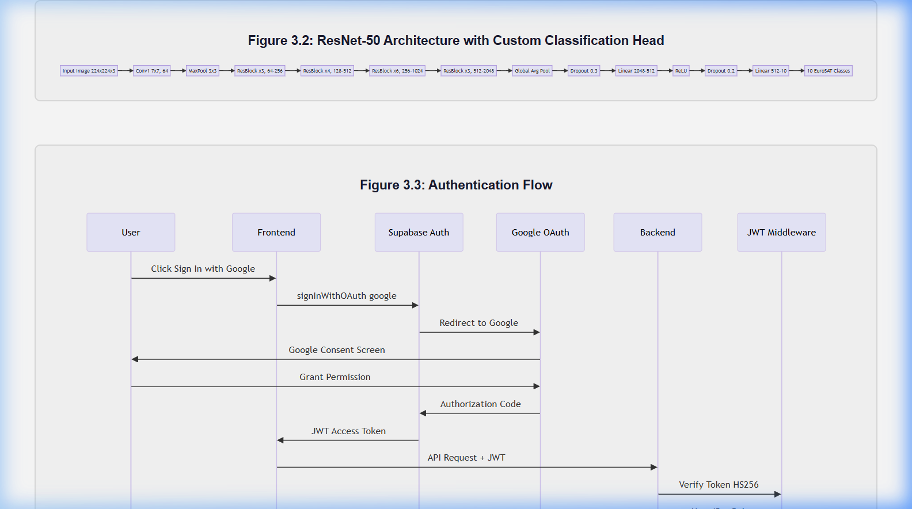
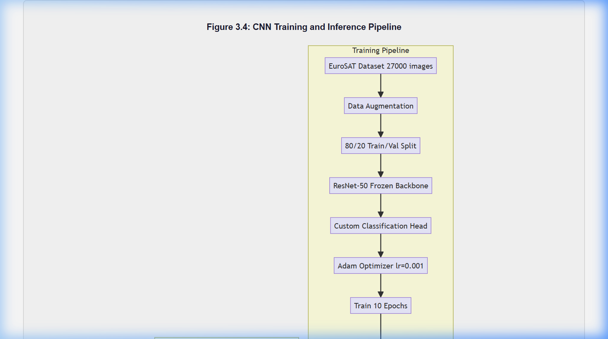

# Software Requirements Specification (SRS)
## GeoVision — AI-Powered Earth Intelligence Platform

---

## 1. Introduction & Project Overview (Explain the Project)

### 1.1 Purpose
The purpose of this Software Requirements Specification (SRS) document is to specify the software requirements, system architecture, and operational workflows for GeoVision. It serves to detail the exact implementations, functionalities, and intended behaviors of the system to ensure all stakeholders, developers, and evaluating bodies have a comprehensive understanding of the platform.

### 1.2 Explain the Project
GeoVision is a robust, full-stack environmental monitoring platform that leverages Artificial Intelligence and real-time satellite imagery to detect and track global ecological threats. Instead of relying on manual field surveys, GeoVision autonomously ingests multispectral data from the European Space Agency's Sentinel-2 satellites. It processes this data to compute critical environmental indices (NDVI for vegetation, NDWI for water) and utilizes a deep learning Convolutional Neural Network (CNN) to classify land-use patterns.

### 1.3 User Classes and Characteristics
1. **Environmental Analysts / Scientists:** Use the platform for in-depth data visualization and NDVI/NDWI trend analysis.
2. **Emergency First Responders:** Utilize the Action Center for disaster evacuation planning and resource dispatch.
3. **NGOs & Policymakers:** Use the Automated PDF Impact Reports for funding and mandate justifications.
4. **Community Volunteers / Rangers:** Provide on-the-ground validation through the Community Portal.

---

## 2. System Architecture & Technical Diagrams

### 2.1 System Architecture Overview
The platform follows a decoupled microservices architecture. The React frontend communicates with the FastAPI backend via RESTful APIs, while Supabase provides identity management and persistence.



### 2.2 Satellite Data Processing Pipeline
The ingestion pipeline handles multispectral data acquisition, spectral index computation (NDVI/NDWI), and CNN patch extraction in parallel.



### 2.3 Authentication and Security Flow
Security is managed via Supabase Auth with Google OAuth. The system uses JWT tokens with HS256 signing for all backend requests.



### 2.4 ResNet-50 AI Architecture & Training
We implemented a 50-layer Residual Network (ResNet). The training pipeline utilizes a weighted cross-entropy loss to handle class imbalance in the EuroSAT dataset.





---

## 3. Overall Description & Implementation (How We Implemented It)

### 2.1 How We Implemented It
The platform was engineered using a modern microservices architecture, splitting responsibilities between a highly responsive frontend, a scalable backend, and an AI inference engine:

1. **AI Model Training:** We utilized PyTorch to train a ResNet-50 CNN on the EuroSAT dataset (27,000 satellite images across 10 classes). Using transfer learning techniques with a frozen backbone, the model achieved a 92.5% validation accuracy in classifying land-use environments.
2. **Backend Architecture:** Built with Python (FastAPI), the backend handles the heavy lifting. It connects to the Sentinel Hub API to fetch live multispectral L2A GeoTIFFs, processes them using `rasterio` and NumPy, and feeds the localized patches to the PyTorch model for real-time inference.
3. **Frontend Dashboard:** A React 18 application built with TypeScript, Tailwind CSS, and shadcn/ui. It communicates with the backend to display Recharts-powered analytics and dynamic UI cards.
4. **Authentication & Database:** We integrated Supabase (PostgreSQL) for secure JWT-based Google OAuth authentication, Row-Level Security (RLS), and persistent storage of active environmental alerts and regional histories.

### 3.1 Functional Requirements Table

| ID | Feature | Description |
|----|---------|-------------|
| FR-01 | **Automated Ingestion** | System fetches Sentinel-2 multispectral tiles every 24 hours. |
| FR-02 | **CNN Land-Use** | AI classifies extracted patches into 10 distinct land-use categories. |
| FR-03 | **Spectral Indices** | Calculates NDVI and NDWI to detect vegetation stress and flooding. |
| FR-04 | **PDF Reporting** | Generates professional, branded PDF impact reports from live data. |
| FR-05 | **Resource Dispatch** | UI for assigning emergency units to high-risk zones. |
| FR-06 | **Predictive Analytics** | Forecasts 6-month environmental risk trajectories using time-series data. |
| FR-07 | **Ground-Truthing** | Allows authorized users to upload mobile photos for alert validation. |

### 3.2 System Features (Real-World Problem Solving)
- **CNN Land-Use Classification**: Identifies geographical environments with 92.5% accuracy.
- **Action Center**:
  - Disaster Evacuation Planner (calculates safe zones).
  - Automated PDF Impact Reports (generates carbon mitigation quotas).
  - Resource Allocation Dashboard (drag-and-drop emergency dispatch UI).
  - ReliefWeb NGO API Integrations (synchronizes with official UN disaster logs).
- **Predictive Forward-Modeling**: Accurately forecasts 6-month trajectories for heat and drought risks.
- **Community Ground-Truthing**: Crowdsourced portal allowing users to upload photographic evidence to validate AI-generated satellite warnings.

---

## 3. System Workflow

### 3.1 24-Hour Automated Cycle
The entire lifecycle of the GeoVision platform runs on a 24-hour automated cycle. Below is the workflow detailing how the intelligence pipeline operates:

1. **Trigger:** The APScheduler in the FastAPI backend initiates the daily monitoring job.
2. **Ingestion:** The system authenticates with the Sentinel Hub API and downloads the latest multispectral tiles (B2, B3, B4, B8) for 6 critical coordinate zones.
3. **Analysis:** The pipeline computes the Normalized Difference Vegetation Index (NDVI) and Water Index (NDWI), whilst simultaneously extracting 224x224 patches for the ResNet-50 deep learning model.
4. **Assessment & Alerting:** The custom Risk Engine aggregates the CNN classifications and spectral indices. If critical thresholds are breached, high-priority alerts are dispatched to the Supabase database.
5. **Visualization:** The React dashboard fetches the newly minted alerts in real-time, displaying them to the user via interactive charts and actionable mitigation tools.

---

## 4. Project Structure

The codebase is logically separated into frontend applications, backend services, machine learning execution, and database configurations.

```text
gsis-main/
├── src/                          # React frontend
│   ├── pages/                    # Dashboard, Upload, Analytics, Action Center
│   ├── components/               # UI components (shadcn/ui, AppSidebar)
│   ├── services/                 # API client, utilities
│   └── integrations/supabase/    # Supabase client & types
├── gsis-backend/                 # FastAPI backend
│   ├── app/
│   │   ├── routers/              # API REST endpoints
│   │   ├── services/             # CNN Inference, NDVI, Sentinel fetcher
│   │   ├── models/               # Pydantic data models
│   │   └── core/                 # Config, security, database connectors
│   └── models/                   # Trained PyTorch model weights (.pt)
├── geo-vision-training/          # ML Training scripts
│   ├── train.py                  # ResNet-50 transfer learning script
│   └── download_eurosat.py       # Dataset downloader
├── supabase/                     # Database migrations
└── public/                       # Static public assets
```

---

## 5. Non-Functional Requirements

1. **Performance Requirement:** The API backend must be capable of processing a 10MB multi-spectral GeoTIFF through the CNN model and returning results within 3 seconds.
2. **Security Requirement:** All routing must be protected by JSON Web Tokens (JWT) through Supabase. Invalid tokens must redirect users to the authentication gateway immediately.
3. **Availability Requirement:** The automated backend scheduler must incorporate a failback to local deterministic simulation data in the event that the external Sentinel Hub API rate limit is exceeded.

---

## 6. Screenshots and Images

- **Landing Page & Dashboard:**
  
- **Upload & Classify Interface:**
  
- **Action Center & Predictive Analytics:**
  
- **Authentication & Sign-In:**
  
