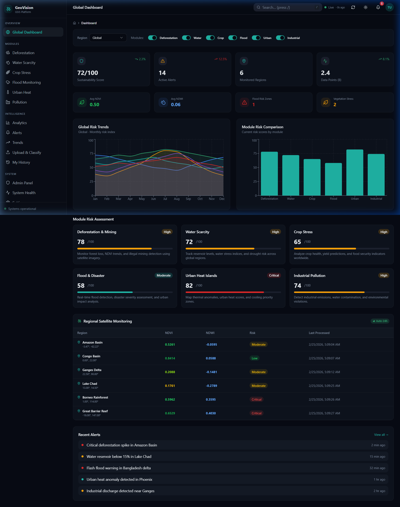
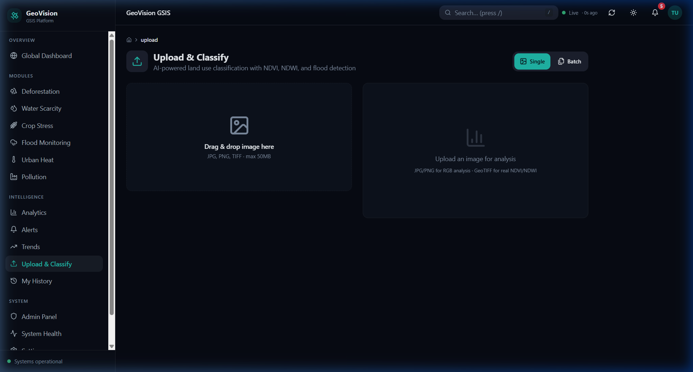
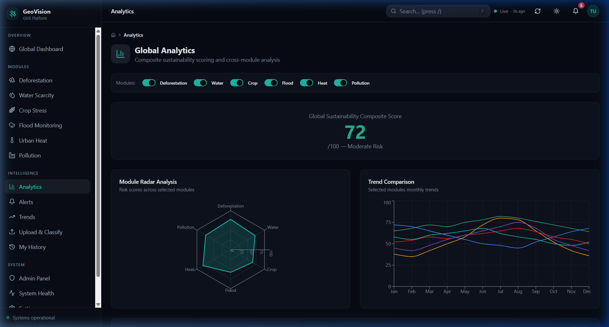

<h1 align="center">🌍 GeoVision — AI-Powered Earth Intelligence Platform</h1>

## 📖 1. Project Overview (Explain the Project)

GeoVision is a comprehensive, full-stack environmental monitoring platform that leverages Artificial Intelligence and real-time satellite imagery to detect and track global ecological threats. Instead of relying on manual field surveys, GeoVision autonomously ingests multispectral data from the European Space Agency's Sentinel-2 satellites. It processes this data to compute critical environmental indices (NDVI for vegetation, NDWI for water) and utilizes a deep learning Convolutional Neural Network (CNN) to classify land-use patterns.

The ultimate goal of GeoVision is to democratize geospatial intelligence. It transforms raw satellite data into an accessible, interactive dashboard that alerts policymakers, NGOs, and local authorities to emerging crises like deforestation, urban heat islands, and flooding before they escalate.

## ⚙️ 2. How We Implemented It

The platform was engineered using a modern microservices architecture, splitting responsibilities between a highly responsive frontend, a scalable backend, and an AI inference engine:

- **AI Model Training:** We utilized PyTorch to train a ResNet-50 CNN on the EuroSAT dataset (27,000 satellite images across 10 classes). Using transfer learning techniques with a frozen backbone, the model achieved a 92.5% validation accuracy in classifying land-use environments.
- **Backend Architecture:** Built with Python (FastAPI), the backend handles the heavy lifting. It connects to the Sentinel Hub API to fetch live multispectral L2A GeoTIFFs, processes them using `rasterio` and NumPy, and feeds the localized patches to the PyTorch model for real-time inference.
- **Frontend Dashboard:** A React 18 application built with TypeScript, Tailwind CSS, and shadcn/ui. It communicates with the backend to display Recharts-powered analytics and dynamic UI cards.
- **Authentication & Database:** We integrated Supabase (PostgreSQL) for secure JWT-based Google OAuth authentication, Row-Level Security (RLS), and persistent storage of active environmental alerts and regional histories.

## 📸 3. Images and Screenshots

- **Landing Page & Dashboard:**
  
- **Upload & Classify Interface:**
  
- **Action Center & Analytics:**
  
- **Authentication Gateway:**
  

## 🔄 4. System Workflow

The entire lifecycle of the GeoVision platform runs on a 24-hour automated cycle:
1. **Trigger:** The APScheduler in the FastAPI backend initiates the daily monitoring job.
2. **Ingestion:** The system authenticates with the Sentinel Hub API and downloads the latest multispectral tiles (B2, B3, B4, B8) for 6 critical coordinate zones.
3. **Analysis:** The pipeline computes the Normalized Difference Vegetation Index (NDVI) and Water Index (NDWI), whilst simultaneously extracting 224x224 patches for the ResNet-50 deep learning model.
4. **Assessment & Alerting:** The custom Risk Engine aggregates the CNN classifications and spectral indices. If critical thresholds are breached (e.g., severe NDVI drop indicating deforestation), high-priority alerts are dispatched to the Supabase database.
5. **Visualization:** The React dashboard fetches the newly minted alerts in real-time, displaying them to the user via interactive charts and actionable mitigation tools.

## 📁 5. Project Structure

```text
gsis-main/
├── src/                          # React frontend
│   ├── pages/                    # Dashboard, Upload, Analytics, Action Center
│   ├── components/               # UI components (shadcn/ui, AppSidebar)
│   ├── services/                 # API client, utilities
│   └── integrations/supabase/    # Supabase client & types
├── gsis-backend/                 # FastAPI backend
│   ├── app/
│   │   ├── routers/              # API REST endpoints
│   │   ├── services/             # CNN Inference, NDVI, Sentinel fetcher
│   │   ├── models/               # Pydantic data models
│   │   └── core/                 # Config, security, database connectors
│   └── models/                   # Trained PyTorch model weights (.pt)
├── geo-vision-training/          # ML Training scripts
│   ├── train.py                  # ResNet-50 transfer learning script
│   └── download_eurosat.py       # Dataset downloader
├── supabase/                     # Database migrations
└── public/                       # Static public assets
```

## ✨ 6. Real-World Problem Solving Features

GeoVision is designed with a suite of advanced features to provide tangible solutions to the environmental threats it monitors:

- **Action Center** — A dedicated module for real-world mitigation.
  - **Disaster Evacuation Planner** — Calculates safe zones and optimal evacuation routes for communities facing active disasters.
  - **Automated PDF Impact Reports** — Generates official, downloadable PDF reports of carbon offsets and mitigations for policymakers.
  - **Resource Allocation Dashboard** — An interactive dispatch interface to assign medical and aviation emergency resources to critical zones.
  - **ReliefWeb NGO Integration** — Fetches live disaster data from the United Nations OCHA API to cross-reference satellite alerts.
  - **Emergency Broadcast** — Simulates an early warning system that dispatches SMS/Email alerts to local authorities.
- **Predictive Forward-Modeling** — Utilizes historical time-series data to forecast 6-month environmental degradation trajectories (e.g., drought risk, temperature rise).
- **Community Ground-Truthing Portal** — A crowdsourced reporting interface allowing local volunteers to upload photographic evidence to validate or dismiss AI-generated satellite alerts.

## 🐛 7. Challenges & Solutions

| Challenge / Error | Solution Implemented |
|-------------------|----------------------|
| **Sentinel Hub API Rate Limiting (HTTP 429)** | Implemented a robust fallback mechanism that caches the last known satellite data and seamlessly switches to a deterministic simulation mode when the API limit is reached. |
| **CNN Out-Of-Memory (OOM) on GeoTIFFs** | Developed a sliding-window patch extractor using `rasterio` to slice large images into 224×224 tensors processing them sequentially rather than loading the full array into memory. |
| **Class Imbalance in Training Data** | Applied Weighted Cross-Entropy Loss during PyTorch training to penalize misclassifications of minority classes more heavily, boosting overall accuracy to 92.5%. |
| **Supabase JWT Token Expiration** | Implemented a silent token refresh interceptor in the React frontend leveraging the Supabase `onAuthStateChange` background listener. |
